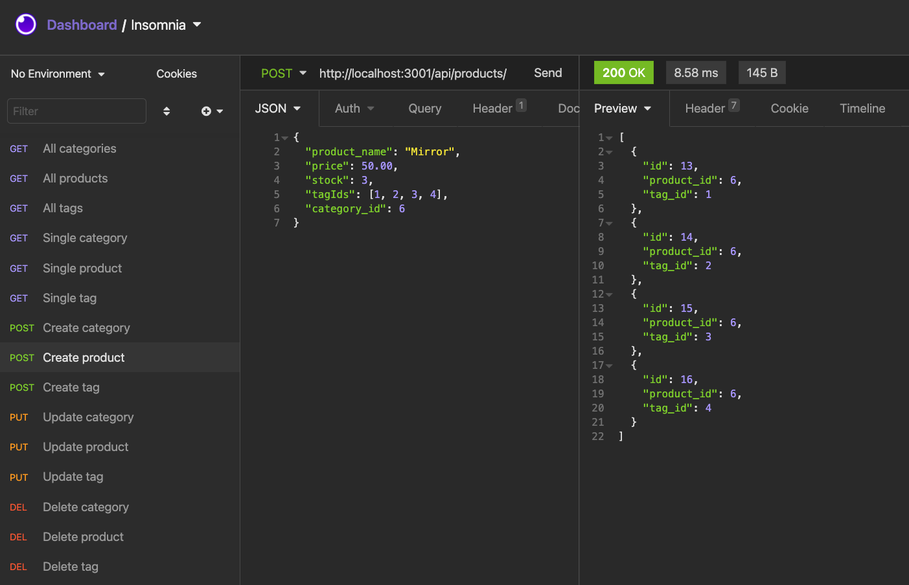
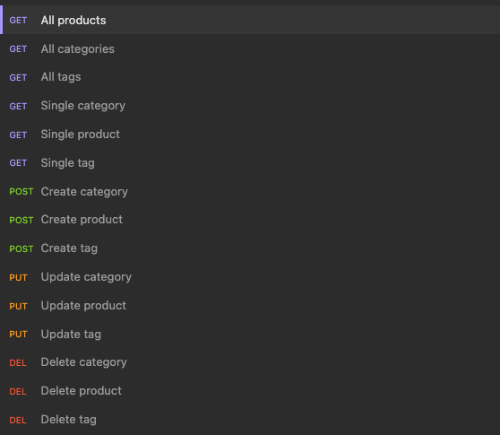

# ECommerce Backend

[How to use ECommerce Backend](https://drive.google.com/file/d/1YwDx5L3ePf7dfKCjN75mRpWcw91wpVGj/view)

## Description

Express.js, Sequelize, and MySQL, powers the back end of Furniture Warehouse, an ecommerce website. The database includes products, categories, and tags and allows requests to easily update the database.

## Table of Contents

- [Installation](#installation)
- [Usage](#usage)
- [Credits](#credits)
- [License](#license)
- [Contributing](#contributing)
- [Questions](#questions)

## Installation

To install this application, you'll need Node.js, MySQL2, Sequelize and Insomnia Core installed on your computer.
From the command line:

1. Clone this repository: `git@github.com:flokamp/e-commerce-site.git`
2. Go to the root directory and install dependencies: `npm install`
3. Install the latest dependencies: `npm install express sequelize mysql2`

## Usage

### Create the schema from the MySQL shell

1. From the root directory of your project, type mysql -u root -p and press Return
2. Enter your MySQL password and press Return again to enter the MySQL shell environment
3. Execute the command: `source db/schema.sql`
4. Exit the shell environement by enterting `quit`

### Seed the database

1. Execute the command: `npm run seed`

### Start the application server

1. Enter `node server` in the command line

### View or update the database

1. Open Insomnia Core
2. Execute a request

## License

## Contributing

Feel free to send pull requests and raise issues.

## Questions

My GitHub: [flokamp](https://github.com/flokamp)

If you have additional questions, email me! kampflo2@gmail.com
